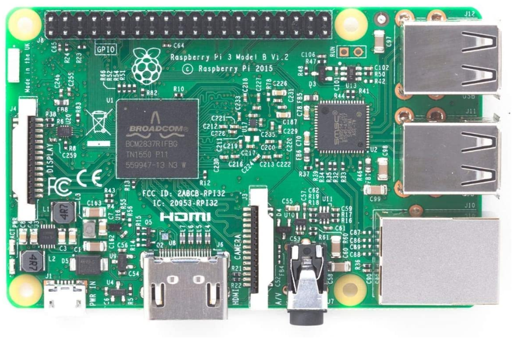
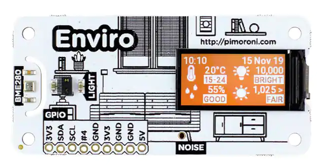
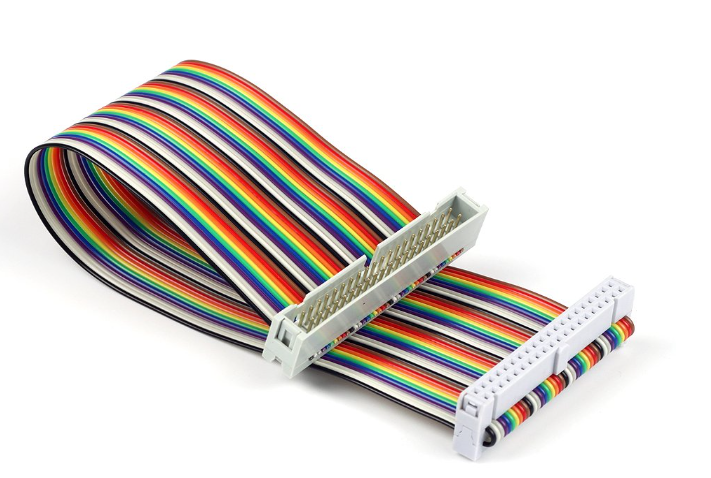
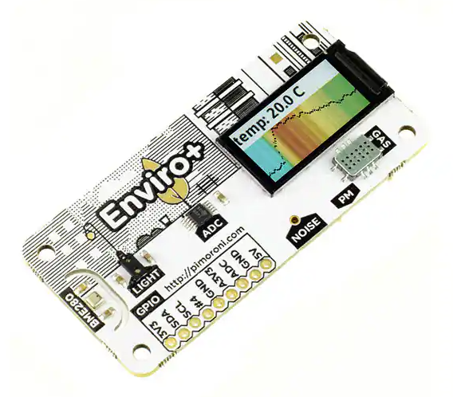
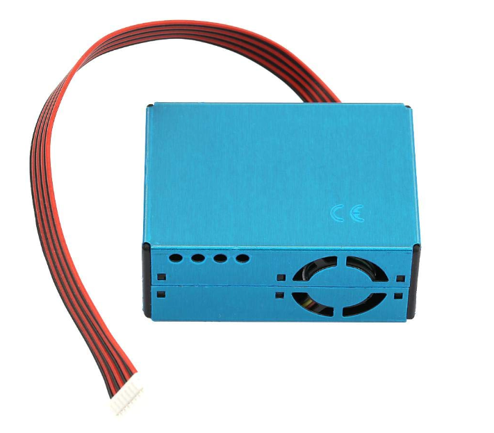

# IoTSensorReadingsFromPiToAzure
Send telemetry to Azure from your Raspberry Pi

## Devices

The following devices are used in this demo.

### Raspberry Pi 3  

Device 1 is the Raspberry Pi 3 [you will likely buy a 4+ now].  Mine is a CanaKit.   

[https://www.canakit.com/raspberry-pi-4-starter-kit.html](https://www.canakit.com/raspberry-pi-4-starter-kit.html)  

  

### Enviro PIM 486

Device 2 is the Enviro PIM 486 Pi Hat, which has a number of built in sensors and runs about $35 dollars.

[https://www.digikey.com/en/products/detail/pimoroni-ltd/PIM486/11205841](https://www.digikey.com/en/products/detail/pimoroni-ltd/PIM486/11205841)  

### GPIO Ribbon

For the connection to be in a place that wasn't directly on the board and so I can close my case, I bought a GPIO ribbon.

[https://www.adafruit.com/product/1988?gclid=CjwKCAjw6raYBhB7EiwABge5Kmco-MSm0-GFPfg2i2CSq_XU0gI4fqcu7dKa_1fcLRWhKzkd2EVleRoCVAYQAvD_BwE](https://www.adafruit.com/product/1988?gclid=CjwKCAjw6raYBhB7EiwABge5Kmco-MSm0-GFPfg2i2CSq_XU0gI4fqcu7dKa_1fcLRWhKzkd2EVleRoCVAYQAvD_BwE)  

I got mine from Amazon but paid more for it and that one is only $3.

[https://www.amazon.com/dp/B07D991KMR?psc=1&ref=ppx_yo2ov_dt_b_product_details](https://www.amazon.com/dp/B07D991KMR?psc=1&ref=ppx_yo2ov_dt_b_product_details)  

  

## Things I wish I had bought/incorporated

I would like to add in gas/air quality.  I wish I had bought the following additional/instead-of parts.

### Enviro PIM 486

I wish I had bought this.  It has a built in connector for the air sensor and all the other things that the 486 has.

[https://www.digikey.com/en/products/detail/pimoroni-ltd/PIM458/10289741](https://www.digikey.com/en/products/detail/pimoroni-ltd/PIM458/10289741)

  

### PMS5003 Digital Output Module

I have bought this but don't have an easy way to directly connect.  The PIM 486 would be plug and play.

[https://www.amazon.com/gp/product/B07S3735CY/ref=ppx_yo_dt_b_asin_title_o03_s00?ie=UTF8&psc=1](https://www.amazon.com/gp/product/B07S3735CY/ref=ppx_yo_dt_b_asin_title_o03_s00?ie=UTF8&psc=1)  

  

## Tools/Services

To complete this activity, you'll need

- Azure IoT Hub
- Add a device to the IoT Hub and get the connection string
- Update the connection string in the appsettings.json file
- .Net 6 SDK on your PI
- Visual Studio Code with SSH extensions to connect to your pi
- Put the code on the PI and run it to send telemetry to your Azure IoT Hub

## Updates

Works in progress that are not complete at this time

1. Docker Container/Compose

    I would like to move this code to a container and use compose to spin it up

1. LTR559 Driver for C#

    Currently, the light and prox readings are hacked in by running a python script and grabbing the output, parsing it and utilizing that output in C# by attaching to a process.

    This is not a good solution, and is a hindrance to the containerization.

    However, I cannot find a driver for the LTR559 so I cannot use C# directly to get light and prox readings.

